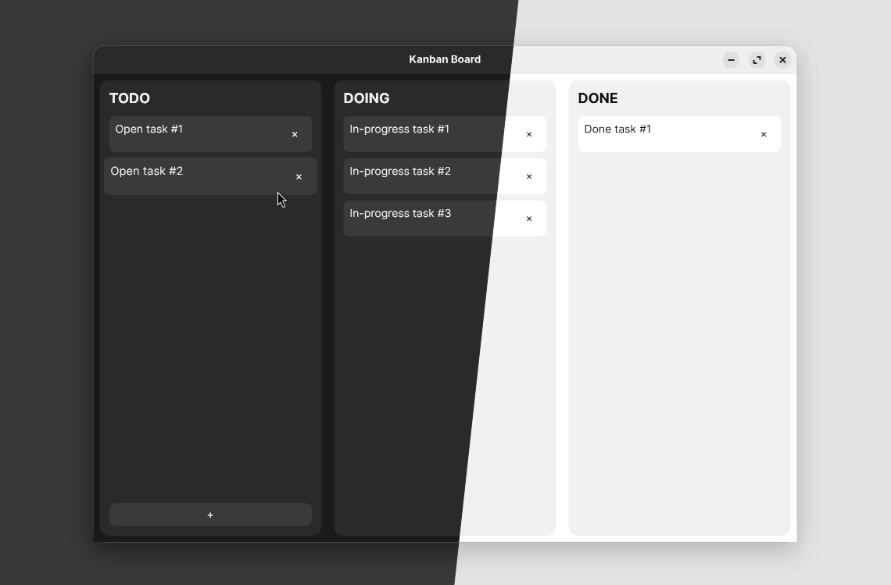

# Avalonia Demo Project: Kanban Board

A lightweight Kanban board application built as a demo/test project using [Avalonia](https://avaloniaui.net/) (11.3.11), a cross-platform .NET UI framework. Focus on drag-and-drop interactions and MVVM architecture.



## Running the application

Download the [latest release](/../../releases/latest) and unzip.

On Windows, simply run the `.exe` file.

On macOS/Linux:

```bash
cd path/to/unzipped/folder
chmod +x Avalonia-Demo-Kanban
./Avalonia-Demo-Kanban
```

## Cloning the project

Prerequisite: .NET 9.0 or newer

Build & run with:

```bash
dotnet run
```
